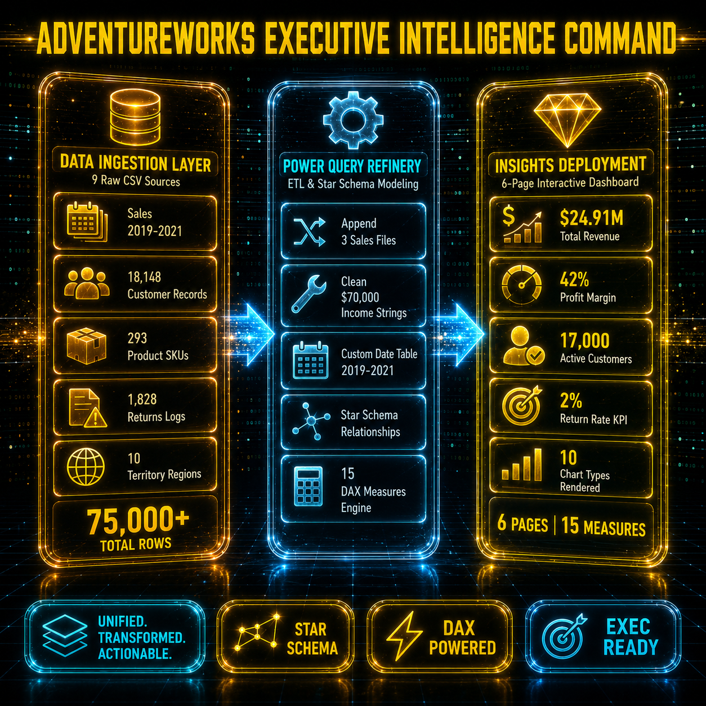
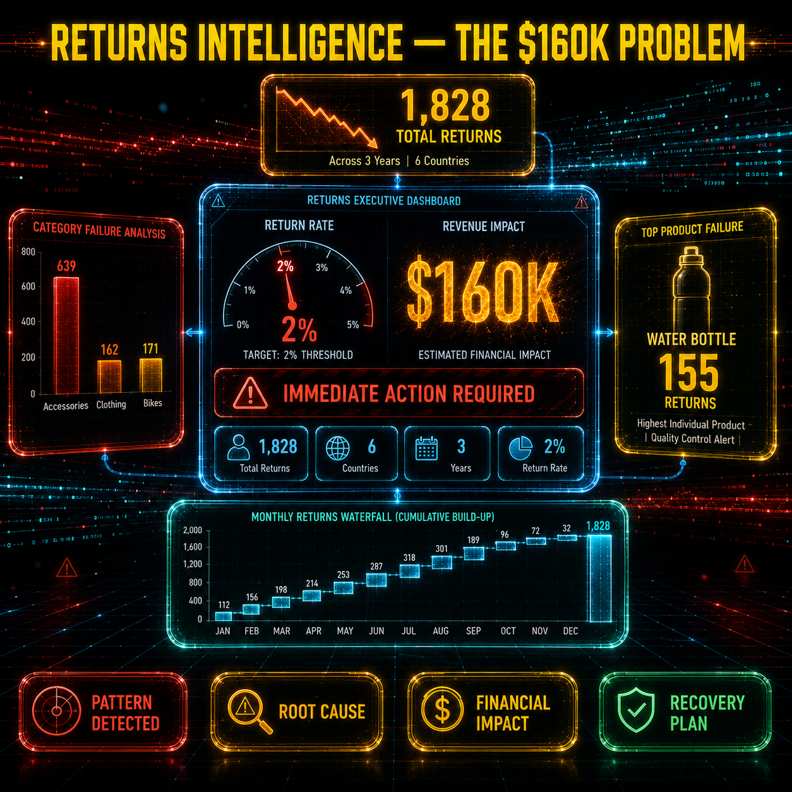
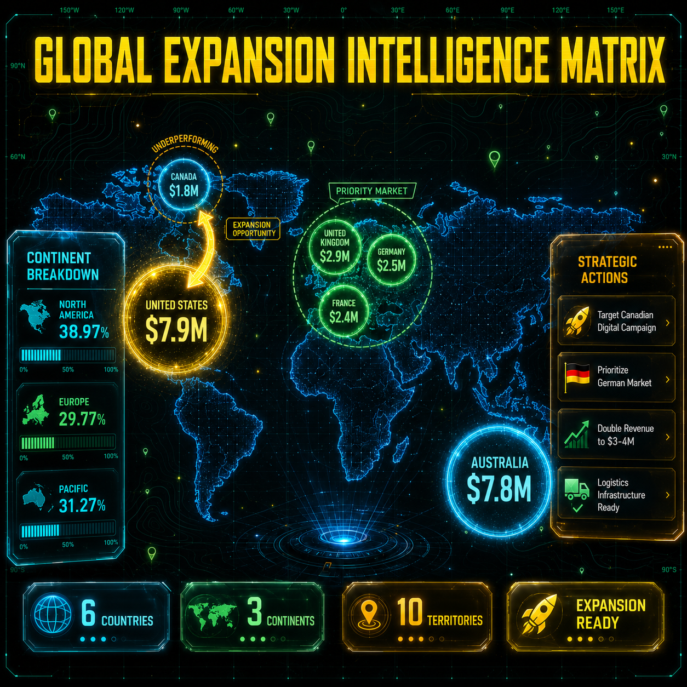
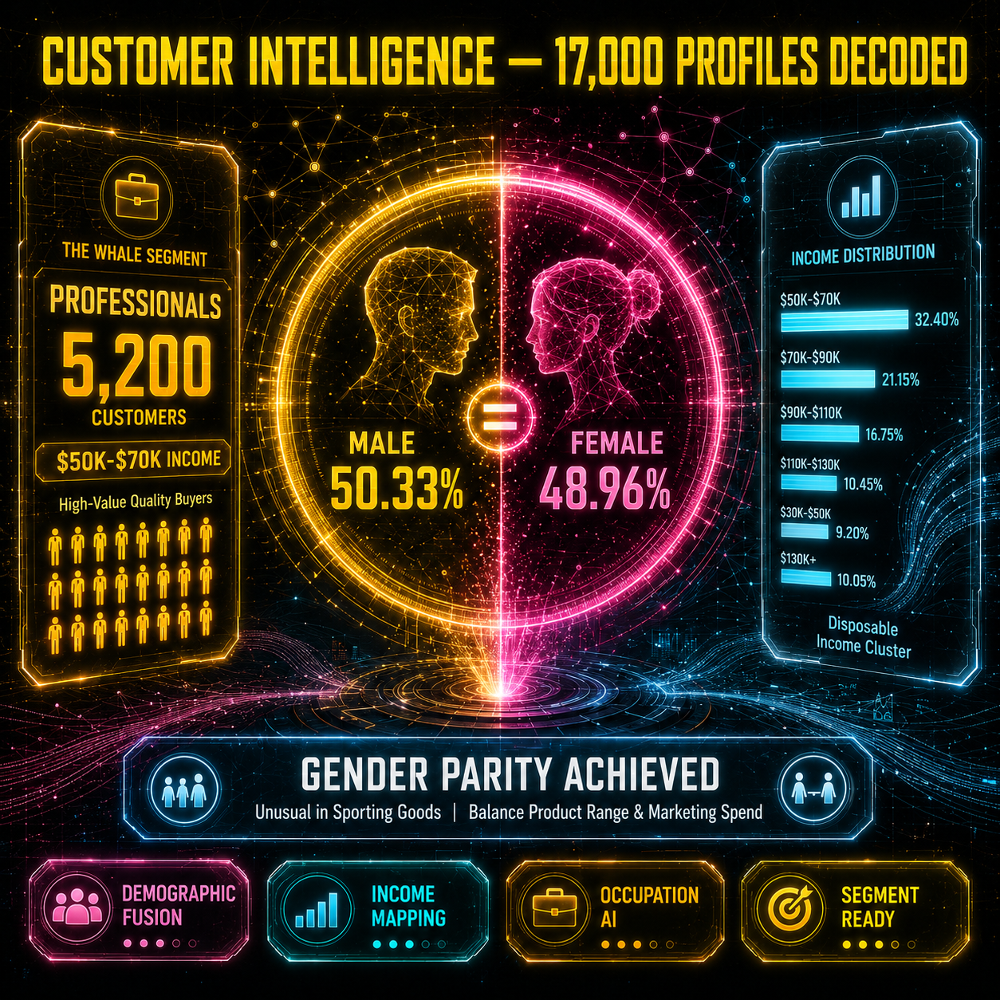

# 🚲 AdventureWorks: Executive Intelligence Dashboard

AdventureWorks is a production-grade business intelligence solution that transforms scattered CSV sales data into a centralized, interactive decision-making system. Built entirely in **Power BI**, it unifies 9 raw data sources into a Star Schema model with 15 custom DAX measures, delivering actionable insights across 6 executive dashboard pages.

---

## 🚀 Key Features

* **Unified Data Ingestion:** Consolidates 3 years of sales data (2019–2021), 18,148 customer records, 293 product SKUs, and 1,828 return logs into a single analytical model.
* **Power Query ETL Pipeline:** Append-transform-load workflow with schema harmonization, currency cleaning, and custom date table generation.
* **Star Schema Data Model:** Industry-standard dimensional modeling with 8 connected tables enabling clean filter propagation and optimal query performance.
* **15 Custom DAX Measures:** Row-level iterators, context transitions, and time intelligence calculations for revenue, profit, returns, and geographic segmentation.
* **6 Interactive Dashboard Pages:** Executive Summary, Sales Overview, Product Analysis, Customer Details, Returns Intelligence, and Geographic Expansion Matrix.

---

## 🏗️ System Architecture

The pipeline flows through three distinct stages — from raw CSV ingestion to executive-ready insights:

---

## 📊 Dashboard Pages & Key Insights

### Page 1 — Executive Summary
High-level business performance with $24.91M total revenue, 42% profit margin, and 17,000 active customers visualized through KPI cards, world bubble maps, and demographic breakdowns.

### Page 2 — Sales Overview
Year-over-year trend analysis with treemap revenue distribution, product performance rankings, and continent-level donut charts revealing 38.97% North America / 31.27% Pacific / 29.77% Europe diversification.

### Page 3 — Product Analysis
Category and subcategory deep-dive with return rate tracking, identifying Accessories as the dominant returns category (639 units vs 171 Bikes).

---

## 🧠 Returns Intelligence — The $160K Problem

A dedicated analytical engine pinpointing the invisible returns crisis costing approximately $160,000 across 3 years:

**Critical Findings:**
* **1,828 total returns** across 6 countries at a 2% return rate — right at the acceptable threshold
* **Accessories dominate failures:** 639 returns vs 162 Clothing vs 171 Bikes
* **Water Bottle is the #1 culprit:** 155 individual returns, triggering a quality control alert
* **Seasonal pattern detected:** Returns accumulate through summer months, peaking in July-August

**Business Action:** Investigate top 5 returned accessories. Improve size guides, product photography, and descriptions to set accurate customer expectations.

---

## 🌍 Geographic Expansion Matrix

The global revenue distribution revealing expansion priorities and underperforming markets:

**Strategic Intelligence:**
| Market | Revenue | Status |
|--------|---------|--------|
| United States | $7.9M | Core Market |
| **Australia** | **$7.8M** | **#2 Market — Pacific Anchor** |
| United Kingdom | $2.9M | Priority Market |
| Germany | $2.5M | European Entry Point |
| France | $2.4M | Growth Opportunity |
| Canada | $1.8M | **Underperforming — Expansion Target** |

**Recommended Actions:**
* 🚀 **Canada:** Launch targeted digital marketing campaign. Potential to double revenue to $3–4M given shared logistics infrastructure with US.
* 🇩🇪 **Germany:** Prioritize for Continental Europe expansion due to strongest cycling infrastructure and $2.5M existing base.

---

## 👥 Customer Intelligence — 17,000 Profiles Decoded

Demographic profiling engine revealing the human layer behind the revenue:

**Segment Analysis:**
* **The Whale Segment:** 5,200 Professionals earning $50K–$70K annually — largest high-value quality buyer cluster
* **Gender Parity Achieved:** Male 50.33% / Female 48.96% — unusual equilibrium in sporting goods requiring balanced marketing spend
* **Income Distribution:** Peak concentration in $50K–$70K disposable income bracket (32.40%)
* **Occupation AI:** Professionals dominate, followed by Skilled Manual and Management segments

**Business Action:** Focus marketing spend on professional networks, cycling clubs, and LinkedIn advertising targeting professionals aged 30–50.

---

## 🛠️ Technical Stack

| Layer | Technology | Purpose |
|-------|-----------|---------|
| Data Ingestion | 9 CSV Files (Sales 2019-2021, Customers, Products, Categories, Subcategories, Returns, Territories) | Raw source data |
| ETL Engine | Power Query | Append queries, data cleaning, currency normalization |
| Data Model | Star Schema (8 tables + 2 custom) | Relationship modeling, filter propagation |
| Time Intelligence | Custom DAX Date Table | Centralized 2019–2021 calendar with Year/Month/Month Name columns |
| Calculations | 15 DAX Measures | SUMX iterators, DIVIDE safety, CALCULATE context transitions, DISTINCTCOUNT |
| Geospatial | Custom GeoLocations Table | Precise lat/long coordinates for 6 countries enabling exact map pin placement |
| Visualization | Power BI Desktop | 10 chart types, KPI visuals with trend/target, slicers, bookmarks |
| Deployment | Power BI Service | Cloud sharing, scheduled refresh, mobile layout |

---

## 📐 Data Model Architecture
